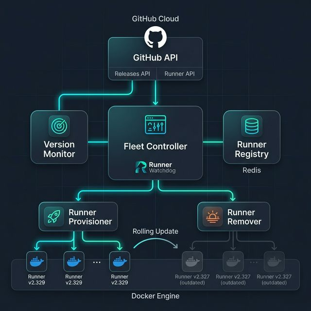

<div align="center">

# 🐕 Runner Watchdog

### Automated Fleet Controller for GitHub Self-Hosted Runners

*Never lose a CI pipeline to a runner version enforcement again.*

[](LICENSE)
[](https://python.org)
[](https://docker.com)
[](https://fastapi.tiangolo.com)

---

[**The Problem**](#-the-problem) · [**How It Works**](#-how-it-works) · [**Quick Start**](#-quick-start) · [**API Reference**](#-api-reference) · [**Configuration**](#%EF%B8%8F-configuration) · [**Contributing**](#-contributing)

</div>

---

## 💥 The Problem

GitHub periodically enforces **minimum runner version requirements** for self-hosted runners. When this happens:

```
❌  Your CI pipelines fail — silently and simultaneously.
❌  Engineers scramble to figure out why builds are broken.
❌  Ops teams manually SSH into machines to upgrade runners.
❌  Deployments are blocked. Hotfixes can't ship. Revenue is at risk.
```

In 2024, GitHub had to **pause a version enforcement rollout** because thousands of self-hosted runners across organizations weren't updated in time, causing widespread CI failures.

**This is a solved problem.** Runner Watchdog fixes it.

---

## 🧠 How It Works

Runner Watchdog continuously monitors GitHub for new runner releases and **proactively replaces outdated runners** before enforcement deadlines — with zero CI downtime.

<div align="center">



</div>

### The Control Loop

```
┌──────────────────────────────────────────────────────────┐
│                                                          │
│   1. DETECT    →  Poll GitHub Releases API               │
│   2. COMPARE   →  Check fleet versions in Redis          │
│   3. PROVISION →  Launch new runners at latest version   │
│   4. DRAIN     →  Wait for new runners to register       │
│   5. REMOVE    →  Gracefully decommission old runners    │
│   6. REPEAT    →  Every CHECK_INTERVAL_SECONDS           │
│                                                          │
└──────────────────────────────────────────────────────────┘
```

### Rolling Updates — Not Big-Bang Replacements

Runner Watchdog replaces runners in **configurable batches** (default: 10% of fleet per cycle) to ensure CI capacity is never fully interrupted:

```
Fleet: 20 runners at v2.327.0
Update: GitHub releases v2.329.0

Cycle 1: Replace 2 runners  →  18 old + 2 new  →  CI stays up ✅
Cycle 2: Replace 2 runners  →  16 old + 4 new  →  CI stays up ✅
   ...
Cycle 10: Replace 2 runners →  0 old + 20 new  →  Upgrade complete 🎉
```

---

## 🚀 Quick Start

### Prerequisites

- Docker & Docker Compose
- A [GitHub Personal Access Token](https://github.com/settings/tokens) with `repo`, `workflow`, and `admin:org` scopes

### 1. Clone & Configure

```bash
git clone https://github.com/YOUR_USERNAME/runner-watchdog.git
cd runner-watchdog

cp .env.example .env
# Edit .env → add your GITHUB_TOKEN and REPO_URL
```

### 2. Build the Runner Image

```bash
docker build \
  --build-arg RUNNER_VERSION=2.329.0 \
  -t github-runner-image:2.329.0 \
  docker/runner-image/
```

### 3. Launch the Stack

```bash
docker compose up --build
```

This starts:

| Service        | Port   | Purpose                                    |
| -------------- | ------ | ------------------------------------------ |
| **Redis**      | `6379` | Runner metadata registry                   |
| **Controller** | `8000` | REST API + background watchdog loop        |

### 4. Verify

```bash
# Health check
curl http://localhost:8000/health
# → {"status": "ok"}

# Check latest runner version
curl http://localhost:8000/version/latest
# → {"latest_version": "2.329.0"}

# Fleet status overview
curl http://localhost:8000/status
```

---

## 📡 API Reference

Runner Watchdog exposes a REST API for fleet inspection and manual control:

| Method | Endpoint           | Description                              |
| ------ | ------------------ | ---------------------------------------- |
| `GET`  | `/health`          | Liveness probe                           |
| `GET`  | `/runners`         | List all runners from local registry     |
| `GET`  | `/runners/github`  | List runners registered on GitHub        |
| `GET`  | `/version/latest`  | Fetch latest runner version from GitHub  |
| `GET`  | `/status`          | Fleet summary — version distribution, upgrade availability |
| `POST` | `/check-update`    | Trigger a manual version check           |
| `POST` | `/trigger-update`  | Trigger a manual rolling update          |

**Example — fleet status:**

```json
{
  "total_runners": 20,
  "baseline_version": "2.327.0",
  "latest_version": "2.329.0",
  "upgrade_available": true,
  "version_distribution": {
    "2.327.0": 16,
    "2.329.0": 4
  }
}
```

---

## ⚙️ Configuration

All settings via environment variables (`.env` file):

| Variable                 | Default              | Description                              |
| ------------------------ | -------------------- | ---------------------------------------- |
| `GITHUB_TOKEN`           | *required*           | GitHub PAT (`repo`, `workflow`, `admin:org`) |
| `REPO_URL`               | *required*           | Target repository for runner registration |
| `REDIS_HOST`             | `redis`              | Redis hostname                           |
| `REDIS_PORT`             | `6379`               | Redis port                               |
| `RUNNER_VERSION`         | `2.329.0`            | Current baseline runner version          |
| `RUNNER_IMAGE_NAME`      | `github-runner-image`| Docker image name for runners            |
| `UPDATE_BATCH_PERCENT`   | `10`                 | % of fleet to replace per rolling cycle  |
| `CHECK_INTERVAL_SECONDS` | `3600`               | Watchdog polling interval (seconds)      |

---

## 📁 Project Structure

```
runner-watchdog/
├── controller/
│   ├── api.py                # FastAPI REST API
│   ├── config.py             # Centralized env-var config
│   ├── github_api.py         # GitHub API client
│   ├── main.py               # Fleet controller + watchdog loop
│   ├── runner_manager.py     # Provisioning, removal, rolling updates
│   └── version_checker.py    # Version comparison logic
├── database/
│   └── redis_client.py       # Redis runner registry (CRUD)
├── docker/
│   └── runner-image/
│       ├── Dockerfile         # Self-hosted runner container image
│       └── start.sh           # Entrypoint with auto-deregistration trap
├── Dockerfile                 # Controller service image
├── docker-compose.yml         # Full stack orchestration
├── requirements.txt
├── LICENSE
├── CONTRIBUTING.md
└── architecture.png
```

---

## 🔐 Security

- Runner containers execute as a **non-root user**
- Runner tokens are **short-lived registration tokens** (not PATs)
- Cleanup traps **automatically deregister** runners on shutdown — no ghost runners
- Docker socket is mounted read-write; run the controller in a **trusted environment**

---

## 🗺️ Roadmap

- [ ] 📊 Web dashboard — real-time fleet visibility
- [ ] 🔔 Slack / Teams notifications on upgrade events
- [ ] 📈 Runner health monitoring (CPU, memory, job load)
- [ ] 🏢 Organization-level runner management
- [ ] ☁️ Cloud provider support (EC2, GCE auto-scaling groups)
- [ ] 🧪 Canary deployments — test new runner versions on a subset first

---

## 🤝 Contributing

Contributions are welcome! See [CONTRIBUTING.md](CONTRIBUTING.md) for guidelines.

---

## 📄 License

[MIT](LICENSE) — built by [Aaron Sabu](https://github.com/YOUR_USERNAME).

---

<div align="center">

**Runner Watchdog** — Because CI infrastructure should manage itself.

</div>
